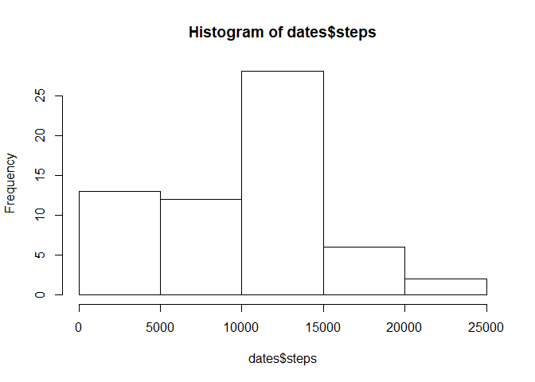
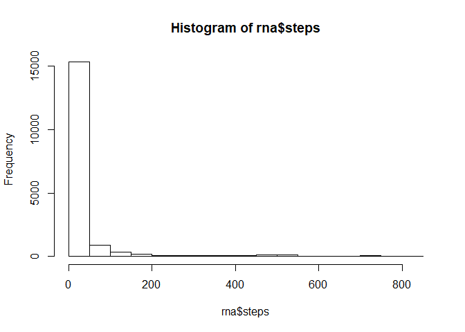
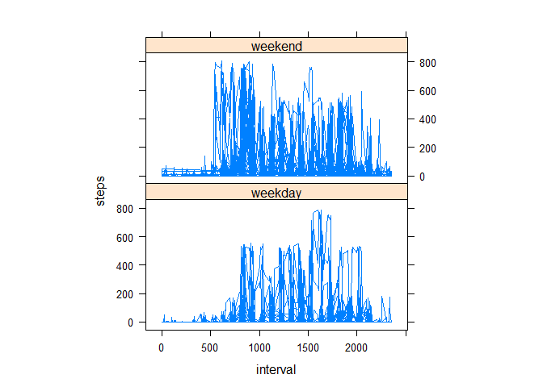

Course Project
==============

Week 2 peer evaluated assignment

Loading and preprocessing the data
----------------------------------

``` r
data <- read.csv(unz("activity.zip", "activity.csv"), header=T, quote="\"", sep=",")
```

What is mean total number of steps taken per day?
-------------------------------------------------

-   Calculate the total number of steps taken per day

``` r
dates<-aggregate(steps~date, data=data, FUN=sum, na.rm=TRUE, na.action=NULL)
```

-   Make a histogram of the total number of steps taken each day

``` r
hist(dates$steps)
```



-   Calculate and report the mean and median of the total number of steps taken per day

``` r
mean(dates$steps)
```

    ## [1] 9354.23

``` r
median(dates$steps)
```

    ## [1] 10395

What is the average daily activity pattern?
-------------------------------------------

-   Make a time series plot (i.e. type = "l") of the 5-minute interval (x-axis) and the average number of steps taken, averaged across all days (y-axis)

``` r
intervals<-aggregate(steps~interval, data=data, FUN=mean, na.rm=TRUE, na.action=NULL)
plot(steps~interval,data=intervals, type = "l")
```

 - Which 5-minute interval, on average across all the days in the dataset, contains the maximum number of steps?

``` r
intervals[which.max(intervals$steps),]$interval
```

    ## [1] 835

Imputing missing values
-----------------------

Note that there are a number of days/intervals where there are missing values (coded as NA). The presence of missing days may introduce bias into some calculations or summaries of the data.

-   Calculate and report the total number of missing values in the dataset (i.e. the total number of rows with NAs)

``` r
sapply(data, function(x) sum(is.na(x)))
```

    ##    steps     date interval 
    ##     2304        0        0

-   Devise a strategy for filling in all of the missing values in the dataset. The strategy does not need to be sophisticated. For example, you could use the mean/median for that day, or the mean for that 5-minute interval, etc. Create a new dataset that is equal to the original dataset but with the missing data filled in. I am choosing to replace all NA values with 0s as the only assumption that can be made is that no steps were taken during the intervals were NAs exist

``` r
## set all NA values to 0 as we can only assume that there was no steps taken during the time
rna <- data
rna[is.na(rna)] <- 0
```

-   Make a histogram of the total number of steps taken each day and Calculate and report the mean and median total number of steps taken per day.

``` r
hist(rna$steps)
```



``` r
mean(rna$steps)
```

    ## [1] 32.47996

``` r
median(rna$steps)
```

    ## [1] 0

Do these values differ from the estimates from the first part of the assignment? Yes, the values are drasticly changed with the value of 0 replacing NA. Now there are many more 0s in the data set
What is the impact of imputing missing data on the estimates of the total daily number of steps? Now that there are many more 0s in the data set, the data is skewed toward displaying a large amount of inactivity. it decreases both the mean and the median, with the meadian becoming 0.

Are there differences in activity patterns between weekdays and weekends?
-------------------------------------------------------------------------

For this part the weekdays() function may be of some help here. Use the dataset with the filled-in missing values for this part.

Create a new factor variable in the dataset with two levels - "weekday" and "weekend" indicating whether a given date is a weekday or weekend day.

``` r
rna$day<-"weekday"
rna$day[as.POSIXlt(rna$date)$wday>0 & as.POSIXlt(rna$date)$wday<6]<-"weekend"
```

Make a panel plot containing a time series plot (i.e. type = "l") of the 5-minute interval (x-axis) and the average number of steps taken, averaged across all weekday days or weekend days (y-axis). See the README file in the GitHub repository to see an example of what this plot should look like using simulated data.

``` r
library(lattice)
xyplot(steps~interval|factor(day),data=rna,aspect=1/2,type="l")
```


